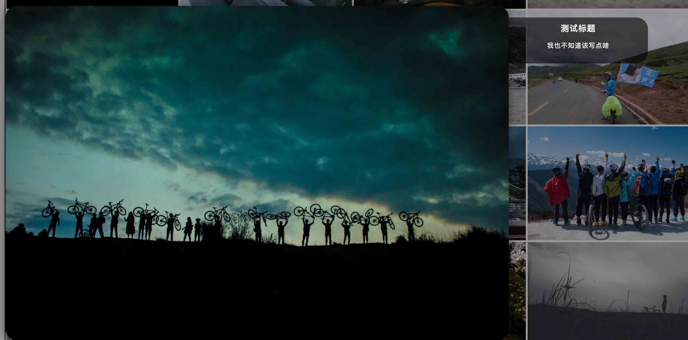

# PhotoWall

### 0.特点

- 只需整理好照片，无论多少文件夹、多少照片，一键生成照片墙；
- 在不对照片进行拉伸和遮掩的前提下，实现对任意比例的大量照片对齐；
- 自动识别照片子目录，根据照片目录对照片进行分类；
- 根据照片的命名对照片进行排序和添加标题、描述信息；
- 通过简易的配置文件（txt）添加大量照片描述、分类描述等额外信息，方便快捷；

### 1.最简易的使用方法

- 1.下载软件（注意区分macOS和windows）

	> 下载地址一：(完整软件内测中)

	> 下载地址二：

- 2.将照片文件夹放到软件根目录下的image目录下（若放在其它路径需要在程序中指定，支持二级目录）

- 3.点击运行程序

	> 3.1 windows用户点击 “windows用户双击这里自动执行.bat”
	
	> 3.2 macOS用户打开终端，在终端中进入软件根目录，输入如下指令
		
		chmod +x macOS用户请使用终端打开此文件.sh & ./macOS用户请使用终端打开此文件.sh

- 4.首先会弹出两个黑框显示程序正在运行的信息，若程序显示运行结束浏览器未打开，请手动用浏览器打开PhotoWall.html （需要联网才能正常显示网页）

### 2.自定义基本信息

- 1.给照片添加标题和简易描述
	
	修改照片文件名，照片标题和照片描述之间用短横线“-”分割，比如“南京-美丽的南京.jpg”，表示该照片标题为“南京”，照片描述为“美丽的南京”。更多命名细节可以参考4.1小节，如需添加大量描述请参考第3小节。

- 2.修改原始照片路径

	或许你已经有了专门用于存放照片的文件夹，不想再花时间整理。
	windows用户：
	
	> 1.右键点击“windows用户双击这里自动执行.bat”，选择用记事本打开
	
	> 2.在文本第一行末尾添加： 
		
		-image_dir 照片地址
	
	比如照片地址为“C:\Users\maicius\Pictures”，修改后的命令如下：
	
		start /wait ImageConvertTool.exe -image_dir "C:\Users\maicius\Pictures"
	再保存并关闭文件，重新双击该文件即可运行
	
	macOS用户的修改过程大致相同

- 3.修改照片的保存地址

	用单反、手机拍摄的照片往往比较大，在网页上进行加载会非常慢，所以首先需要进行压缩，生成缩略图和用于详细查看的大图。ImageConvertTool.exe其实就是做的这个压缩转换的过程。转换后的照片会默认保存在软件根目录下的image文件夹下。若需要修改保存的地址，和2.2中一样，使用记事本编辑该bat文件，在文本末尾添加一行：
	
		-result_dir 照片地址

### 3.自定义网站、照片信息——photo_info.txt

虽然上面的方法已经能生成照片墙，但是你会发现其中的背景照片、网页标题，都不是你想要的，或者你想添加大量的照片描述，但是在照片标题中不好写。其实这些信息都可以在photo_info.txt中进行自定义。

photo_info.txt是一个简单的配置文件，为方便用户编辑，因此选择用txt格式。它能配置的具体内容如下：

- 自定义网站导航栏标题、副标题
- 自定义主页标题
- 自定义主页背景照片，不限张数
- 开启情侣纪念日（没错，就是对情侣的照片墙做了优化）
- 自定义照片分类目录和分类描述
- 自定义照片标题和照片描述

下面开始介绍如何编写该文件以实现上述功能。resource目录下提供了多个photo_info.txt的编写模板
编辑中需要遵守以下规范：

- 每一行表示一项配置
- 以双斜线//开始的行表示注释，是为了帮助用户理解而添加的，程序在解析中会忽视该行
- 符号#表示分隔符，所以正文编辑中请不要出现该符号
- 每一行的第一个词是关键词，程序根据该词来对解析后面的内容。程序使用的关键词有以下几个(区分大小写)：
	
		TITLE、BACK、MID、PART、DAYS、root
		
- 每一行配置编写的顺序没有严格的规定

#### photo_info.txt编写介绍：

- 自定义网站导航栏、副标题

	> 格式：TITLE#网站名#副标题

	> 范例：TITLE#小麦冬#不会骑车的摄影师不是好的程序猿
	
	> 手机端效果图：
	
- 自定义网页标题

	> 格式：MID#网页标题
	
	> 范例：MID#2019年度影集
	
	> chrome效果图：

- 自定义主页背景照片

	> 格式：BACK#照片路径1#照片路径2#照片路径3#....
	
	其中照片路径可以是相对地址，也可以是绝对地址。照片不限张数，可以一直加。照片默认是1分钟换一张
	
	> 范例1：BACK#back/back\_1.jpg#back/back\_2.jpg
	
	> 范例2：BACK#back/back\_1.jpg#back/back\_2.jpg#back/back\_3.jpg#back/back\_4.jpg
	
- 开启情侣纪念日
	
	> 格式：DAYS#背景照片#纪念日期
	
	在填写了纪念日之后，会出现一览计时，计算从该天到现在在一起的天数。如果不填写日期，就不会出现该栏。
	
	> 范例：DAYS#back/back_5.png#2015/11/09
	

- 照片的分类标题和描述

	添加照片时，可以在image目录下建立多个文件夹，每个文件夹表示一个分类。文件夹的标题默认就是分类的名称，在网页展示时，会在该累=类图片的顶部中间显示。若还需要添加副标题或描述，只能在这里进行配置。需要注意的是，这里配置的优先级比文件夹名称的优先级高，就是如果这里的配置会与文件夹名称不一致，会优先使用这里的配置（因为文件夹的名称主要用于排序）
	> 格式：PART文件夹名#分类名#分类描述
	
	> 范例：PART骑行#骑行#回首向来萧瑟处，归去，也无风雨也无晴
	
	> “PART骑行” 表示该文件夹名叫“骑行”，
	
	> 效果图：
	
	根目录的默认文件名是root，若是要对根目录进行命名，需要写PARTroot。比如：
	
	> PARTroot#银杏#金色的秋天

- 照片标题与描述
	
	与照片分类一样，这里的配置的描述优先级比文件命名高。需要注意的是，对照片的配置信息必须写在分类的后面。
	
	> 格式：
			
		PART1文件夹名#分类名#分类描述
		照片文件名#照片标题#照片描述
	
	> 范例：
		
		PART骑行#骑行#回首向来萧瑟处，归去，也无风雨也无晴
		0.jpg#Test Title#Test Description 测试描述
		1.jpg#测试标题#我也不知道该写点啥
		PART其它#其它#随手拍
		0.jpg#Test Title#测试描述
		1.jpg##
		PARTroot#银杏#金色的秋天
		IMG_9600.jpg#银杏#一叶知秋
	
	照片标题若为空，将使用照片的文件名
			

### 4.温馨提示

#### 4.1.整理照片

- 1.推荐的照片命名方法：

	> [数字][照片标题]-[照片描述].[照片格式]，其中数字用于排序
	
	> 比如：1南京-美丽的南京.jpg
	
	上面的命名方式只是推荐，并不是必须，比如以下的方法都是支持的：
	> IMG_001.jpg （将直接使用文件名作为照片标题，缺少照片描述）
	
	> 南京-美丽的南京.jpg (缺少排序数字，将使用python的默认排序)
	
	支持的图片格式有：
	
	> jpg、png、JPG、jpeg、JPEG、PNG、bmp、BMP
	
	如要添加大量描述，可在photo_info.txt中进行配置

- 2.照片位置
	
	默认的位置为项目根目录下的image文件夹，如要修改位置，在启动程序时指定参数即可。

- 3.照片分类
	
	image目录下每个子文件夹将被作为一个分类，该分类的标题就是该子文件夹的名字。请不要使用small和middle命名文件夹，因为这处理结果将保存在该文件夹下。
	
	分类的标题和子标题可以在photo_info.txt中进行配置

### 效果图

- 主页，可通过配置文件添加标题

- 照片墙，无论照片比例差别多大，都能自动实现对齐

