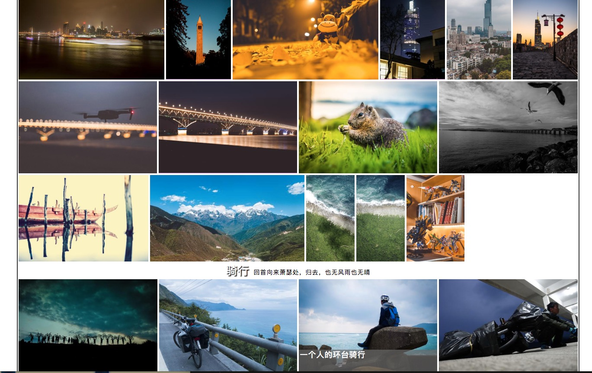

# PhotoWall

### 特点

- 只需整理好照片，一键生成照片墙。原生JS/CSS实现，不依赖于node或服务器，开箱即用；
- 在不对照片进行拉伸和遮掩的前提下，实现对任意比例的大量照片对齐；
- 自动识别照片子目录，根据照片目录对照片进行分类；
- 根据照片的命名对照片进行排序和添加标题、描述信息；
- 通过简易的配置文件（txt）添加大量照片描述、分类描述等额外信息，方便快捷；

### 最简易的使用方法

- 1.下载软件（注意区分macOS和windows）

	> 下载地址一：(完整软件内测中)

	> 下载地址二：

- 2.将照片文件夹放到软件根目录下的image目录下（若放在其它路径需要在程序中指定）

- 3.点击运行程序

	> windows用户点击 “windows用户双击这里自动执行.bat”

- 4.若程序显示运行结束浏览器未打开，请手动用浏览器打开PhotoWall.html （需要联网才能正常显示网页）

### 温馨提示

用单反、手机拍摄的照片往往比较大，在网页上进行加载会非常慢，所以首先需要进行压缩，生成缩略图和用于详细查看的大图

#### 1.整理照片

- 1.推荐的照片命名方法：

	> [数字][照片标题]-[照片描述].[照片格式]，其中数字用于排序
	
	> 比如：1南京-美丽的南京.jpg
	
	上面的命名方式只是推荐，并不是必须，比如以下的方法都是支持的：
	> IMG_001.jpg （将直接使用文件名作为照片标题，缺少照片描述）
	
	> 南京-美丽的南京.jpg (缺少排序数字，将使用python的默认排序)
	
	支持的图片格式有：
	
	> jpg、png、JPG、jpeg、JPEG、PNG、bmp、BMP
	
	如要添加大量描述，可在photo_info.txt中进行配置

- 2.照片位置
	
	默认的位置为项目根目录下的image文件夹，如要修改位置，在启动程序时指定参数即可。

- 3.照片分类
	
	image目录下每个子文件夹将被作为一个分类，该分类的标题就是该子文件夹的名字。请不要使用small和middle命名文件夹，因为这处理结果将保存在该文件夹下。
	
	分类的标题和子标题可以在photo_info.txt中进行配置

### 效果图

- 主页，可通过配置文件添加标题

- 照片墙，无论照片比例差别多大，都能自动实现对齐

- 点击图片查看大图，照片标题、描述可通过配置文件添加

